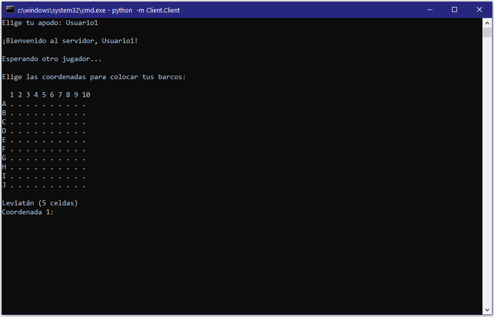
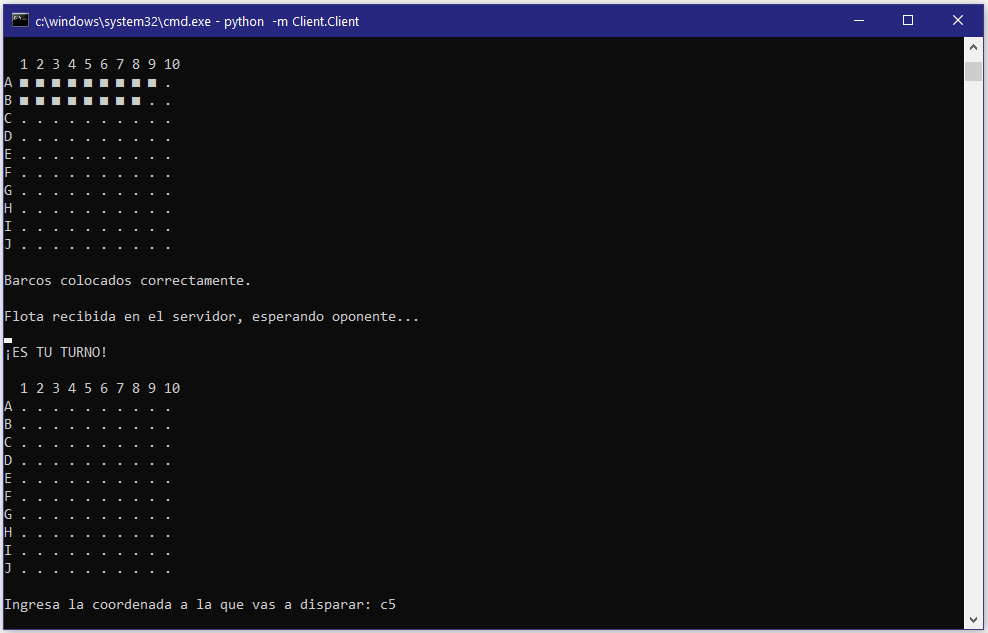
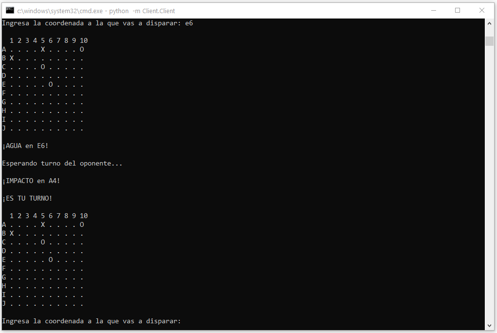
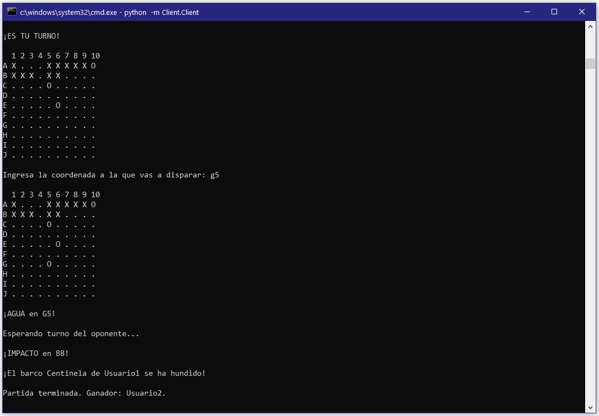

# Battleship - Juego de Batalla Naval en Red

Battleship es un juego de batalla naval en red desarrollado en Python. Se juega entre dos jugadores que se conectan a través de una arquitectura cliente-servidor. Cada jugador coloca sus barcos en un tablero y luego se turnan para disparar, intentando hundir la flota del oponente.

## Características

- **Multijugador en Red:** Juego diseñado para dos jugadores conectados mediante sockets.
- **Comunicación en Tiempo Real:** Uso de mensajes JSON para el intercambio de datos entre cliente y servidor.
- **Interfaz por Consola:** Tableros interactivos para la colocación de barcos y para realizar disparos.
- **Validación de Jugadas:** Verificación de coordenadas válidas y control de solapamientos en la colocación de barcos.
- **Notificaciones de Estado:** Mensajes informativos durante el juego (turnos, impactos, hundimientos, etc.).

## Capturas de Pantalla

### Colocación de barcos

### Comienzo del juego

### Pantalla de disparo

### Final del juego
